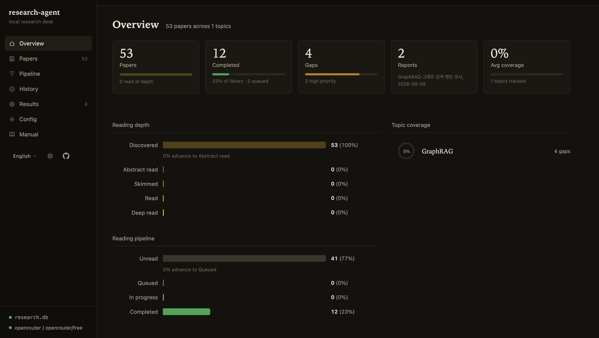
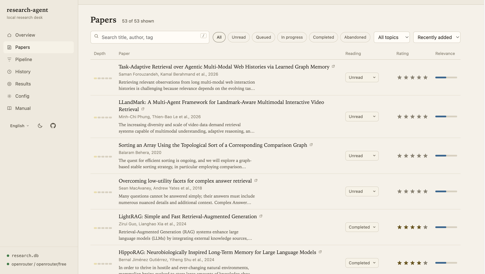

<div align="center">

# research-agent

> Your long-term research memory — papers indexed, gaps found, reports generated

<p align="center">
  <a href="https://github.com/epicsagas/research-agent/stargazers"></a>
  <a href="https://github.com/epicsagas/research-agent/issues"></a>
  <a href="https://github.com/epicsagas/research-agent/commits/main"></a>
</p>
<p align="center">
  <a href="https://github.com/epicsagas/research-agent/releases"></a>
  <a href="https://github.com/epicsagas/research-agent/releases"></a>
  <a href="LICENSE"></a>
</p>

<p align="center">
  <b>English</b> |
  <a href="docs/i18n/ko/README.md">한국어</a> |
  <a href="docs/i18n/ja/README.md">日本語</a> |
  <a href="docs/i18n/zh-Hans/README.md">简体中文</a> |
  <a href="docs/i18n/zh-Hant/README.md">繁體中文</a> |
  <a href="docs/i18n/es/README.md">Español</a> |
  <a href="docs/i18n/fr/README.md">Français</a> |
  <a href="docs/i18n/de/README.md">Deutsch</a> |
  <a href="docs/i18n/pt/README.md">Português</a> |
  <a href="docs/i18n/ru/README.md">Русский</a> |
  <a href="docs/i18n/it/README.md">Italiano</a>
</p>

</div>

## What is this?

research-agent is a **research server for AI agents**: it indexes papers (arXiv,
Semantic Scholar, local PDFs) into a local SQLite library, and your agent drives
it over MCP — ingesting, searching, tracking reading progress, analyzing
coverage gaps with its own model, and filing survey reports. No API key
required.

The same binary also works as a standalone CLI for terminals and scripts.

## Web UI

<p align="center">
  
  
</p>

## Showcase

**[The Ontology Lineage](https://epicsagas.github.io/ontology-explorer/en/)** — 2,300 years of ontology research distilled into one static page (Korean · English): a lineage timeline, an integrated architecture, a five-stage learning route, and a browser for all 425 papers — collected, gap-analyzed, and organized with [research-agent](https://github.com/epicsagas/research-agent).
**[The Uncanny Valley of AI Writing](https://epicsagas.github.io/uncanny-writing/)** — why readers turn away from AI-generated text, fact-checked (Korean · English): 5 cited sources independently verified, 86 papers from arXiv/OpenAlex mapped across 7 themes, counter-evidence, and a 4-gap ledger — collected, gap-analyzed, and organized with research-agent.

## Features

| | Feature | Why it matters |
|--|---------|----------------|
| 🤖 | MCP server | 18 tools your agent drives directly over stdio — no API key needed |
| 🧠 | Agent-native analysis | Gap analysis and reports run inside your agent: tools hand over structured state, the agent reasons, results are persisted |
| 🔗 | Citation graph | Paper-to-paper reference edges from OpenAlex, forward and reverse, optionally labeled with Semantic Scholar citation intents |
| 📚 | Paper indexing | arXiv, Semantic Scholar, OpenAlex, Europe PMC (PubMed), bioRxiv-style preprints, local PDFs, and Zotero (a running instance or its export files) |
| 🔍 | Full-text search | FTS5 trigram over title, abstract, notes, tags, keywords and body — works offline |
| 📂 | Topic trees | Organize research hierarchically with sub-topics |
| 📖 | Reading tracker | Queue, track, and rate what you've read |
| ⚡ | Single binary | No runtime, no server — just `research` |

## Quick Start

Install it as a plugin in your AI agent — no Rust toolchain needed:

### Claude Code

```bash
claude plugin marketplace add epicsagas/research-agent
claude plugin install research-agent@research-agent
```

### Codex

```bash
codex plugin marketplace add epicsagas/research-agent
codex plugin add research-agent@research-agent
```

### Antigravity (agy)

```bash
agy plugin install https://github.com/epicsagas/research-agent
agy plugin enable research-agent
```

### Grok Build

```bash
grok plugin marketplace add epicsagas/research-agent
grok plugin install research-agent@research-agent --trust
```

### Hermes Agent

```bash
hermes plugins install https://github.com/epicsagas/research-agent
hermes plugins enable research-agent
```

Hermes loads the root `plugin.yaml` and `register(ctx)` in `__init__.py`.
It has no MCP support, so the agent drives `research` through the bundled
skill's CLI commands — install the binary first (`brew install
epicsagas/tap/research-agent` or the curl installer); the SessionStart
auto-install hook does not apply to hermes. If skills_guard blocks the
install scan, set `plugins.scan_on_install: false` in the hermes config.

The plugin auto-installs the `research` binary on session start and exposes
18 MCP tools, so the agent can ingest, search, analyze with its own model, and file reports on its own.

Once installed, ask your agent things like:

- "Ingest recent papers on graph neural network training from arXiv"
- "What gaps are left in my <topic> coverage?"
- "Generate a survey report for <topic>"

What those requests look like on the tool level:

| You ask | The agent chains |
|---------|------------------|
| Survey a topic end to end | `init` → `topic_add` → `ingest` (arXiv/S2, linked to the topic) → `topic_brief` → the agent reasons over the brief with its own model → `gaps_record` → `ingest` again aimed at the recorded gaps → `report_material` → `report_save` |
| Find something already in the library | `query_papers` → `paper_body(id, query=...)` quotes the matching passage with its section and page |
| Track what you have read | `update_read` (status, 1-5 rating); `state` for the coverage overview |
| Open the dashboard | Bash: `research dashboard`, then it tells you http://127.0.0.1:7777 is up |

Everything runs against one local SQLite library (default
`~/.research/research.db`). For a project-private library, point the server at
a different file once in the host's MCP config (`"args": ["mcp", "--db",
"./project.research.db"]`, `--db` is a global flag), or have the agent pass
`--db` on skill/CLI invocations.

## How your agent uses it

The plugin auto-installs the `research` binary on session start and starts the
**stdio MCP server** (`research mcp`) — the agent discovers and calls the tools
directly; no human typing CLI commands.

**Tools** (18): `init` · `ingest` · `index_rebuild` · `import_papers` ·
`paper_body` · `paper_references` · `query_papers` · `topic_brief` ·
`gaps_record` · `list_gaps` · `report_material` · `report_save` ·
`topics_list` · `topic_add` · `state` · `update_read` ·
`papers_missing_keywords` · `enrich_paper`.

Analysis is **agent-native**: `topic_brief` and `report_material` hand over the
structured library state (papers, reading progress, recorded gaps, coverage),
the agent reasons over it with its own model, and `gaps_record` / `report_save`
persist the findings. When inspecting text, `paper_body` accepts an optional `query`
to return anchored evidence snippets (with section and page) instead of the whole body,
saving context. No `[llm]` config or API key is required anywhere in the
MCP flow.

Smoke test the server over raw JSON-RPC:

```bash
printf '%s\n' \
  '{"jsonrpc":"2.0","id":1,"method":"initialize","params":{"protocolVersion":"2025-06-18","capabilities":{},"clientInfo":{"name":"t","version":"0"}}}' \
  '{"jsonrpc":"2.0","method":"notifications/initialized"}' \
  '{"jsonrpc":"2.0","id":2,"method":"tools/list","params":{}}' \
  | research mcp 2>/dev/null
```

The `mcp` cargo feature is **on by default**; build CLI-only with
`cargo build --no-default-features`.

## Standalone CLI (secondary)

Prefer driving it by hand? The same binary works as a plain CLI.

```bash
# macOS / Linux — pre-built binary, no Rust required
curl --proto '=https' --tlsv1.2 -LsSf \
  https://github.com/epicsagas/research-agent/releases/latest/download/install.sh | sh

# Windows — pre-built binary, no Rust required
irm https://github.com/epicsagas/research-agent/releases/latest/download/install.ps1 | iex

# Homebrew (macOS / Linux)
brew install epicsagas/tap/research-agent
```

### Using the dashboard

Same database, visual side. Launch it from a terminal, browse it in a browser:

```bash
research dashboard        # then open http://127.0.0.1:7777 (loopback only)
```

| Screen | What it shows |
|--------|---------------|
| Overview | Library size, reading depth, pipeline funnel, topic coverage |
| Papers | The library table; click a row for details, open the built-in reader for page-anchored bodies or the stored PDF, edit reading status and rating |
| Pipeline | Where every paper sits from discovered to deep read |
| History | Reverse-chronological feed of everything that happened |
| Results | Knowledge gaps and generated reports |
| Config | Edit `[llm]`, workspace path, dashboard bind settings (token required off loopback) |

Typical loop: check Overview for topic coverage, open Results for the recorded
gaps, go back to the terminal and aim the next ingest at those gaps, then track
reading progress under Papers.

### First-run onboarding

Run `research init` in a terminal and it walks you through the settings that
matter: database location, the LLM provider used for gap analysis and reports
(the key itself is read from the env var you name, never stored in the file).
Local servers (Ollama, LM Studio) are probed for their
loaded models so you pick from what actually exists. Re-running it is safe:
existing values become the defaults and nothing is reset.

Everything that is configurable shows up in `~/.research/config.toml`:
options you have not set appear as commented-out lines with their defaults,
so the file documents itself. `research init --no-onboard` skips the prompts
(also automatic when stdin is not a terminal, so scripts are never blocked).

## Updating

| Method | Command |
|--------|---------|
| curl installer (macOS/Linux) | Re-run the install script above |
| PowerShell installer (Windows) | Re-run the install command above |
| Homebrew | `brew upgrade epicsagas/tap/research-agent` |

Verify the installed version:

```bash
research --version
```

## Commands

| Command | Description |
|---------|-------------|
| `research init` | Initialize research workspace (interactive onboarding in a terminal: provider, env-var key name; `--no-onboard` to skip) |
| `research ingest <query> [--source arxiv\|s2\|openalex\|europepmc\|preprints\|all] [--limit <n>] [--topic <id>]` | Ingest papers from arXiv, Semantic Scholar, OpenAlex, Europe PMC (PubMed), or preprint servers (bioRxiv, medRxiv, …); optionally link directly to a topic |
| `research ingest [--source zotero] [query] [--topic <id>]` | Read papers from a running Zotero over its local API (`ZOTERO_BASE_URL` overrides default endpoint, needs "Allow other applications on this computer to communicate with Zotero" enabled); no query pulls the whole library. Not part of `--source all` — a personal library is not a discovery source |
| `research ingest --source pdf --path <file\|dir> [--topic <id>]` | Ingest local PDF files (full body text is stored and searchable) |
| `research import <file\|dir>` | Import BibTeX/BibLaTeX, CSL-JSON, or Zotero JSON files (desktop export or API shape), with abstracts, tags, and normalized DOIs; re-imports skip papers already in the library |
| `research index [--rebuild]` | Rebuild the FTS search index |
| `research reingest [--missing-pages]` | Re-extract stored PDF bodies (adds page markers to bodies ingested before they existed) |
| `research query <q> [--evidence]` | Search papers (FTS5 full-text); `--evidence` also shows the matching body text with its section and page |
| `research references <id> [--cited-by] [--intents]` | Fetch citation-graph edges from OpenAlex; `--cited-by` reverses the direction, `--intents` labels edges with Semantic Scholar citation intents |
| `research gaps [--topic <id>]` | Analyze knowledge gaps (CLI: uses `[llm]` if configured) |
| `research report --topic <id>` | Generate research report (CLI: uses `[llm]` if configured) |
| `research topics list` | List all topics |
| `research topics add <name> [--parent <id>]` | Add a new topic (specify `--parent` to create a sub-topic) |
| `research read <id> [--status <status>] [--rating <1-5>]` | Update reading status or rating |
| `research read <id> --body` | Print a paper's stored body text |
| `research status` | Show research state overview |
| `research export --to zotero [--apply]` | Push paper tags into a running Zotero, matched by normalized DOI. Dry-run by default (prints what would change, writes nothing); `--apply` writes. Items changed in Zotero are skipped, never merged. CLI-only by design — no MCP tool |
| `research enrich [id] [--keywords "..."]` | Add search keywords to papers so paraphrased queries hit (uses `[llm]` when configured; without one prints the papers needing keywords) |
| `research dashboard [--port <n>]` | Serve the local web dashboard (read-only views + reading-status editing; loopback by default, token-gated on other hosts) |
| `research mcp` | Start the stdio MCP server (alias: `serve`) |

Verifying the Zotero push needs a running Zotero (10+ for writes): run
`cargo test zotero_write -- --ignored` for the live read, then do one
`research export --to zotero --apply` against a test item and confirm the tag
appears in Zotero. Writes pop a per-item confirmation dialog unless you pick
"Always Allow" (confirmations are capped at five per minute).

Every subcommand also accepts a global `--db <path>` flag to use a specific
database instead of `~/.research/research.db` — useful for isolated or test
workspaces.

### Example workflows

**Research loop: survey, find gaps, fill them**

```bash
research init                                          # first run only: sets up DB + LLM settings
research topics add "Graph DB internals"               # prints the topic ID
research ingest "latch-free graph database" --topic <TOPIC_ID> --limit 20
research gaps --topic <TOPIC_ID>                       # what the survey missed
# aim the next ingest at what the gap analysis flagged:
research ingest "MVCC snapshot isolation graph store" --topic <TOPIC_ID>
research status                                        # papers, coverage, gaps per topic
```

`research gaps` and `research report` use the `[llm]` provider from
onboarding; without one they return placeholders instead of failing.

**Find something already ingested**

```bash
research query "latch-free transaction" --evidence     # matches body text, shows section and page
research read <PAPER_ID> --body                        # dump the stored full text
research read <PAPER_ID> --status completed --rating 5
```

**One library per project**

```bash
research --db ./project.research.db init
research --db ./project.research.db ingest "your topic" --topic <TOPIC_ID>
research dashboard --db ./project.research.db
```

## Requirements

- Rust 1.92+ (only if building from source; pre-built binaries need nothing)
- Data lives at `~/.research/` (`research.db` index, `config.toml`)
- Linux binaries target glibc ≥ 2.38 (Ubuntu 24.04+)
- Optional: an LLM for `research gaps` / `research report` **from the CLI only** — set `[llm]` in `~/.research/config.toml` (`provider`, `model`, `api_key_env`, and `base_url` for OpenAI-compatible endpoints); the key is read from that env var at call time. The MCP flow never needs it
- Config reference: `[dashboard] port` (default 7777), plus `host` and `token` when you bind beyond loopback — a token is generated into `config.toml` and required for every request
- Optional: `research enrich` adds search keywords so queries worded
  differently from the abstract still find the paper. It uses `[llm]` when set;
  without one it prints the papers needing keywords, for an agent (or you) to
  fill in via `research enrich <ID> --keywords "..."`. See
  [ROADMAP.md](ROADMAP.md) for what is deliberately not built yet

## Contributing

See [CONTRIBUTING.md](CONTRIBUTING.md) and the [ROADMAP](ROADMAP.md). PRs welcome.

## License

[APACHE-2](LICENSE).
